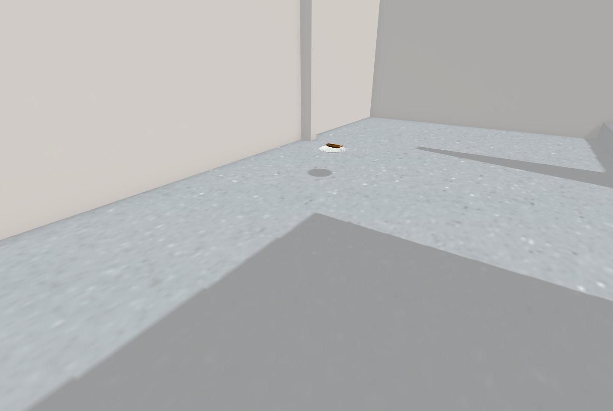
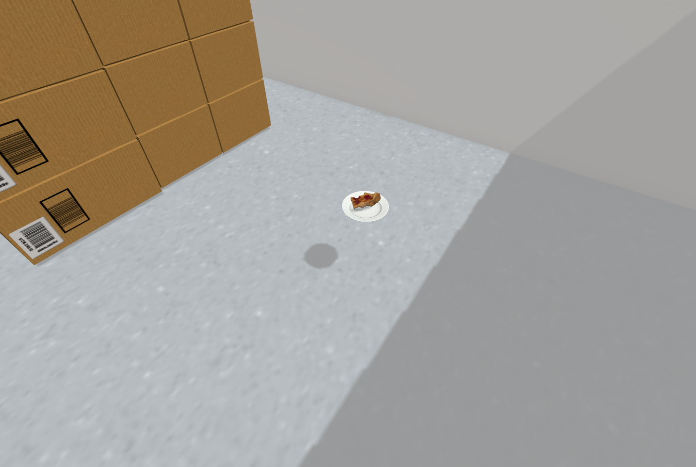
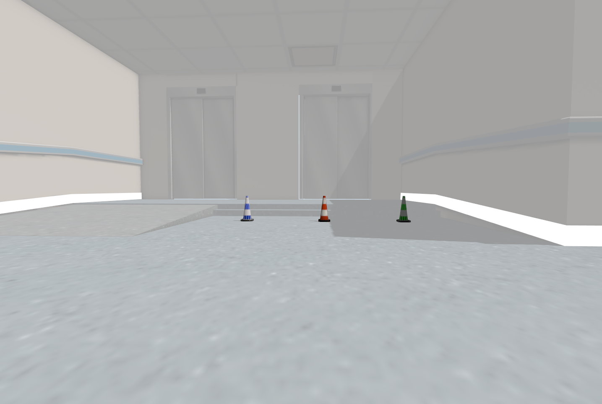
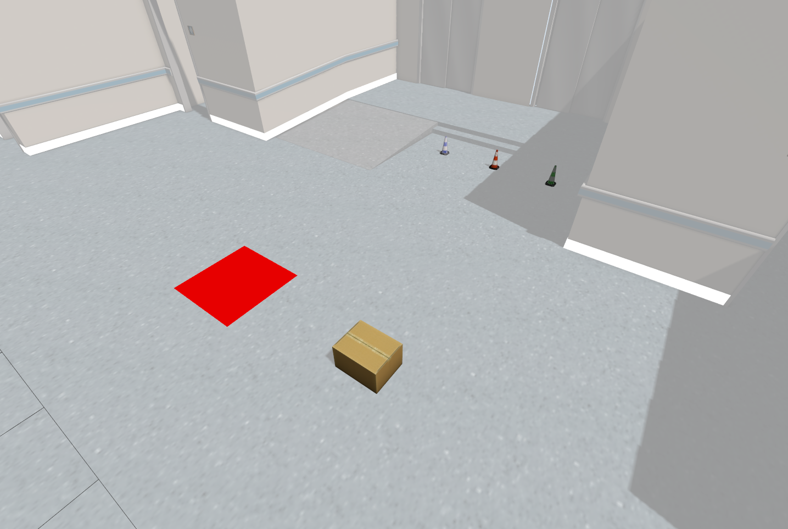
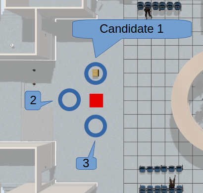
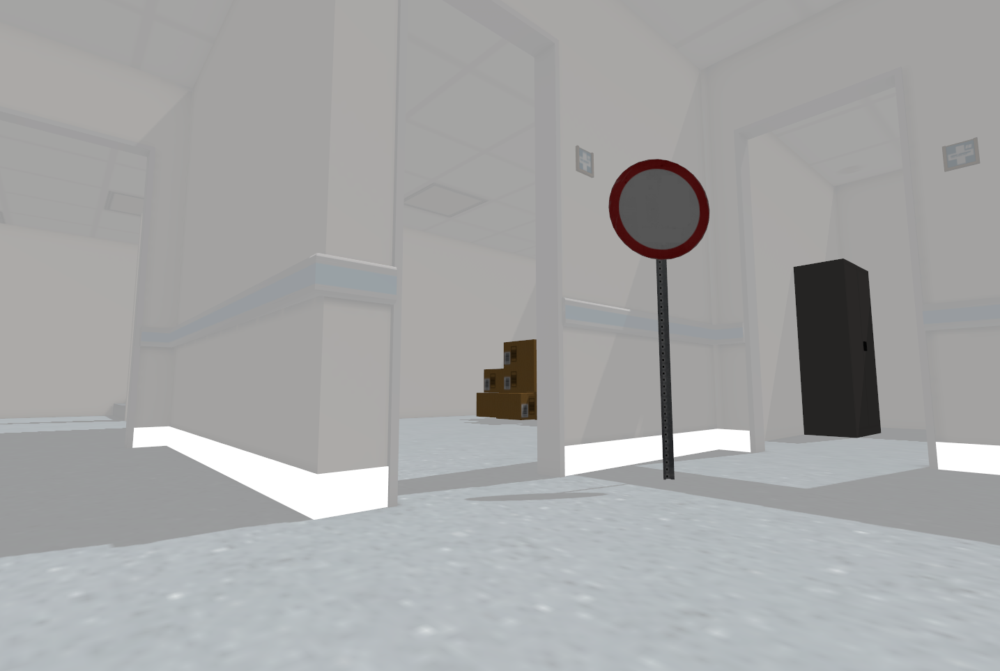
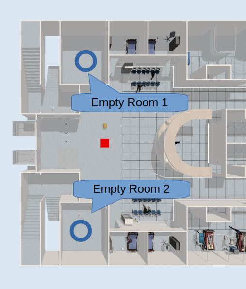

# Creating Robot Artificial Intelligence Project (CRAIP)

This repository is for ROS2 practice of Fall 2025 "Creating Robot Artificial Intelligence Project" class.

It contains a collection of ROS2 packages for controlling the Unitree Go1 quadruped robot in Gazebo simulation environment.

---

# ⚠️ Caution (Only After Git Clone)
This repository is currently under active development and **frequent updates** may occur.

To ensure you are working with the **latest version** of this project, please run the following command in your terminal:

```bash
cd make_ai_robot
git fetch origin
git status

# Update your workspace (Be careful to use)
git pull origin main
```

### ⚠️ Important Note:

Be careful not to overwrite your local changes when pulling updates. We recommend that you create new packages and work on them.

---

# 🔧 Prerequisites

- **Operating System**: Ubuntu 24.04
- **ROS2 Distribution**: Jazzy Jalisco
- **Gazebo**: Harmonic

---

# 📦 Packages Overview

## 1. **go1_simulation**
Gazebo Harmonic simulation environment for the Unitree Go1 robot with full ROS2 integration.
- URDF/Xacro robot description
- ROS2 control integration
- Ground truth pose publisher
- Keyboard teleoperation
- Map publisher and generator

## 2. **path_tracker**
MPPI (Model Predictive Path Integral) based path tracking controller for mobile robots.
- C++ implementation of MPPI algorithm
- Python example script for path generation
- Real-time trajectory tracking

## 3. **ros2_unitree_legged_controller**
ROS2 control interface for Unitree legged robots.
- Custom ROS2 controller plugin
- Joint-level control interface
- Compatible with ros2_control framework
- Hardware abstraction layer

## 4. **ros2_unitree_legged_msgs**
Custom ROS2 message definitions for Unitree robots.
- Motor command/state messages
- High-level command/state messages
- IMU, BMS, and sensor messages
- Compatible with Unitree SDK

## 5. **unitree_guide2**
High-level locomotion controller for Unitree Go1 robot.
- Finite State Machine (FSM) for gait control
- Balance control and estimation
- Trotting gait implementation
- ROS2 integration for simulation

## 6. **environment**
Worlds and models for simulation.
- World files like hospital.world, empty.world, etc.
- Models which will be used in the world files

---

# 📥 Installation

**If you want to use Docker (optional)**: Please refer to [docker/README.md](docker/README.md).

## Step 1: Clone the Repository

```bash
cd ~
git clone https://github.com/roy9852/make_ai_robot.git
```

## Step 2: Install Dependencies

Use `rosdep` to automatically install all required dependencies:

```bash
# Update apt list and upgrade
sudo apt update
sudo apt upgrade

sudo apt-get install python3-rosdep
sudo rosdep init
rosdep update

# Update apt list again (ROS2 packages)
sudo apt update

cd ~/make_ai_robot
# This command will take a while 
# Run 'source /opt/ros/jazzy/setup.bash' if there is no $ROS_DISTRO
rosdep install -i --from-path src --rosdistro $ROS_DISTRO -y
```

This will install:
- Gazebo Harmonic and ROS2 integration (`ros_gz_sim`, `ros_gz_bridge`)
- All ROS2 packages (rclcpp, rclpy, tf2, ros2_control, etc.)
- System dependencies (Eigen, Boost, etc.)

### Step 3: Build the Workspace

```bash
colcon build
```

You should see:
```bash
Starting >>> ros2_unitree_legged_msgs
Starting >>> aws_robomaker_hospital_world
Starting >>> path_tracker
Starting <<< aws_robomaker_hospital_world [2.13s]
Finished <<< ros2_unitree_legged_msgs [10.2s]                                    
Starting >>> ros2_unitree_legged_control
Starting >>> unitree_guide2
Finished <<< ros2_unitree_legged_control [14.9s]                        
Starting >>> go1_simulation
Finished <<< path_tracker [25.6s]                                       
Finished <<< go1_simulation [2.41s]                                      
Finished <<< unitree_guide2 [20.0s]                       

Summary: 6 packages finished [30.4s]
```

## Step 4: Source the Workspace

```bash
source install/setup.bash
```

Add to your `~/.bashrc` for automatic sourcing:
```bash
echo "source ~/make_ai_robot/install/setup.bash" >> ~/.bashrc
```

**Note:**

By default, ROS2 should be sourced first: `source /opt/ros/jazzy/setup.bash`. 

Keep in mind that if you have edited your source code, you need to rebuild and source `setup.bash` of your packages.


## Step 5: Understand the Workspace Structure

After building, your workspace will have these directories:

```
make_ai_robot/
├── src/                    # Source code (you edit files here)
│   ├── go1_simulation/
│   ├── path_tracker/
│   ├── environment/
│   ├── ros2_unitree_legged_controller/
│   ├── ros2_unitree_legged_msgs/
│   └── unitree_guide2/
├── build/                  # Temporary build files (auto-generated)
├── install/                # Compiled packages (auto-generated)
├── log/                    # Build logs (auto-generated)
└── docker/                 # For docker users
```

**Note:**
- Only edit files in `src/` directory
- Never manually edit files in `build/`, `install/`, or `log/`
- If build fails, you can safely delete `build/`, `install/`, and `log/` and rebuild the packages
- Always source `install/setup.bash` after building

---

# 🚀 Usage

## 1. Launch Go1 Simulation in Gazebo

Start the complete simulation environment:

```bash
ros2 launch go1_simulation go1.gazebo.launch.py use_gt_pose:=true
```

You should see both Gazebo and RViz:

In RViz, you can see a colored 3D pointcloud from the RGB-D camera and a red 2D pointcloud from the LiDAR


**Launch Arguments:**
- `use_gt_pose` - Use Ground Truth (GT) pose of "trunk" link for localization (Data is from Gazebo)
- `world_file_name:=<world_name>.world` - Choose world (hospital, empty, cafe, house) (Default: hospital)
- `x:=0.0 y:=1.0 z:=0.5` - Initial robot position (meter) (Default: x=0.0, y=1.0, z=0.5)
- `roll:=0.0 pitch:=0.0, yaw:=0.0` - Initial robot orientation (radian) (Default: roll=0.0, pitch=0.0, yaw=0.0)

**Example:**
```bash
ros2 launch go1_simulation go1.gazebo.launch.py use_gt_pose:=true world_file_name:=empty.world x:=-1.0 y:=0.0 yaw:=1.57
```

### Real Time Factor

If your computer does not have a GPU, the simulation may be too slow, which will prevent the robot from walking properly. You should check the Real Time Factor (RTF) in the Gazebo simulation. It should be at least 50%. 


Launch file, by default, tries to use GPU for Gazebo simulation. To check whether GPU is being used, run this command:
```bash
nvidia-smi
```

If your computer performance is limited, try to use `empty.world` first.

### ⚠️ Important Note:

Currently, you are using the ground truth pose of the robot from the simulator. However, **you should implement your own localization module without relying on ground truth data.** For the final project, it is not allowed to use any ground truth values. All information must come from sensors (RGB-D Camera, LiDAR, IMU, and map), and you need to estimate the robot's state from these sensors.

## 2. Visualize pre-built 2D occupancy grid map

To visualize the map in RViz, run this command:
```bash
ros2 launch go1_simulation visualize_map.launch.py
```

In RViz, you should see:


You can compare the pointcloud (RGB-D and LiDAR) with the pre-built map

## 3. Unitree Guide Controller

Run the high-level locomotion controller:

```bash
ros2 run unitree_guide2 junior_ctrl
```

After you run this node, press a number key (1-5) to change the robot's state in the same terminal

**Robot States (FSM States)**
- **Number 1**: Passive mode - Robot is passive, no joint control (initialization)
- **Number 2**: Fixed stand - Robot stands up with fixed position
- **Number 3**: Free stand - Robot stands up with balance control (can adapt to external forces)
- **Number 4**: Trotting - Robot performs trotting gait (not recommended without proper setup)
- **Number 5**: Move base - Robot can move using `/cmd_vel` commands (velocity control mode)

**Operation Order After Running Node (5 Steps):**
- **Step 1**: Spawn the robot in Gazebo environment and start `junior_ctrl` node
- **Step 2**: Press number 1 for initialization
- **Step 3**: Press number 2 to stand up the robot
- **Step 4**: After the robot stands up, press number 5. Then the robot's body will drop slightly
- **Step 5**: Now, you can move your robot with `/cmd_vel` topic

Please watch below video


### Keyboard Teleoperation

Control the robot with keyboard after running `junior_ctrl` node:

```bash
ros2 run go1_simulation move_go1_with_keyboard.py
```

You can also use a CLI command (this command is for rotation):
```bash
ros2 topic pub /cmd_vel geometry_msgs/msg/Twist "{linear: {x: 0.05, y: 0.0, z: 0.0}, angular: {x: 0.0, y: 0.0, z: 0.2}}" -r 10
```

## 4. Path Tracking

**Step 1**: Launch the MPPI path tracker:

```bash
ros2 launch path_tracker path_tracker_launch.py
```

**Step 2**: Generate and follow a path to specific pose:

```bash
# Move to specified 2D pose 
# Run this code, wait a few seconds
ros2 run path_tracker move_go1.py 
# Enter desired 2D position (x, y, yaw): ex) 5 1 0
```

**Step 3**: Compare goal pose and real pose!:
```bash 
# Read x, y, z, qx, qy, qz, qw and compare with your command
# You need to convert the quaternion to a yaw angle
ros2 topic echo /go1_pose

# Or you can use
ros2 topic echo /go1_pose_2d
```

**How it works:**
1. The path tracker subscribes to `/local_path` (desired path)
2. It uses `/go1_pose` (current robot position) for feedback
3. It publishes `/cmd_vel` commands to move the robot
4. MPPI algorithm optimizes the control commands in real-time

**Note:**
- Make sure the robot is in "move base" mode (press 5 in `junior_ctrl` terminal)
- The robot will generate a smooth curved path to the target

### ⚠️ Important Note:

The current `move_go1.py` does not consider collisions at all. **You should implement your own path planner for collision avoidance**. The planned path will be passed to `path_tracker_launch.py`, and the robot will follow that path.

Also, the path tracking ability might not be optimal. **For better path following, you can tune the parameters in `path_tracker/config/mppi.yaml`.**

---

# 📝 Final Project:

## 💯 Scoring Structure

The final project consists of two parts: **Module Design** and **Competition**.

**Total: 100 points**
- **Module Design**: 40 points
- **Competition**: 60 points

**Note**: Projects are evaluated on a team basis, not individually.

### Module Design (40 points)

You will build three essential modules for navigation:

| Module | Points | Package Name |
|--------|---------|--------------|
| Localization | 20 pts | `localization` |
| Path Planning | 10 pts | `path_planning` |
| Perception | 10 pts | `perception` |

### Competition (60 points)

You will integrate all modules into a complete navigation system to accomplish five missions.

- **5 missions** × 10 points each = 50 points
- **Bonus**: +10 points for the most challenging mission (determined by lowest success rate)
- **Total**: 60 points

---

## Module Design 1. `localization` 

**Goal**: Create a `localization` package for particle filter-based robot localization using available sensors and map data.

**Why this matters**: 

The path tracker relies on accurate robot pose estimation. Without robust localization, the robot cannot determine its position and will be unable to follow paths correctly.

**What you need to do:**

Create a ROS2 package named `localization` with nodes (Python or C++) that:

1. **Subscribe to sensor and map data**:
   - LiDAR data (`/scan`)
   - IMU data (`/imu_plugin/out`)
   - Map data (`/map`)
   - Optionally: Camera data for visual odometry

2. **Estimate the robot's 3D pose**:
   - Implement a particle filter for localization
   - Fuse sensor data to improve accuracy
   - Handle uncertainty and noise in sensor measurements

3. **Publish the estimated pose**:
   - Topic: `/go1_pose` 
   - Message type: `geometry_msgs/msg/PoseStamped`
   - Frame ID: `map`

4. **Broadcast TF transformations**:
   - `map` → `odom`: Corrected odometry based on localization
   - `odom` → `base`: Odometry from robot motion
   
   This maintains the standard ROS2 navigation transform tree.

**Related Topics:**
| Topic | Message Type | Description |
|-------|--------------|-------------|
| `/go1_pose` | geometry_msgs/msg/PoseStamped | Robot pose (x, y, z, qx, qy, qz, qw)|
| `/tf` | tf2_msgs/msg/TFMessage | Transformation tree information between links |
| `/map` | nav_msgs/msg/OccupancyGrid | 2D occupancy grid map for localization |
| `/scan` | sensor_msgs/msg/LaserScan | 2D Lidar data |
| `/imu_plugin/out` | sensor_msgs/msg/Imu | IMU measurements |
| `/camera_face/camera_info` | sensor_msgs/msg/CameraInfo | Camera information of face camera |
| `/camera_face/image` | sensor_msgs/msg/Image | RGB image of face camera |
| `/camera_face/depth` | sensor_msgs/msg/Image | Depth image of face camera |
| `/camera_face/points` | sensor_msgs/msg/PointCloud2 | Colored point cloud of face camera |
| `/camera_top/camera_info` | sensor_msgs/msg/CameraInfo | Camera information of top camera |
| `/camera_top/image` | sensor_msgs/msg/Image | RGB image of top camera |
| `/camera_top/depth` | sensor_msgs/msg/Image | Depth image of top camera |
| `/camera_top/points` | sensor_msgs/msg/PointCloud2 | Colored point cloud of top camera |

**Learning Steps:**

1. **Explore available sensors**:
   - Use the following commands to inspect sensor topics:
     - `ros2 topic list` - List all available topics
     - `ros2 topic info <topic_name> --verbose` - Get detailed topic information
     - `ros2 topic echo <topic_name>` - View real-time topic data
     - `ros2 topic hz <topic_name>` - Check publishing frequency
  
2. **Study reference code**:
   - **`go1_gt_pose_publisher.py`**: Understand how to:
     - Publish `PoseStamped` messages
     - Broadcast TF transforms using `tf2_ros`
     - Structure the transform tree (`map`, `odom`, `base` frames)
   - **`publish_pointcloud.py`**: Learn how to:
     - Subscribe to ROS2 topics
     - Process sensor data
     - Publish processed data

3. **Study relevant algorithms**: 
   - **Particle Filter**: Monte Carlo Localization (MCL)
   - **Scan Matching**: Iterative Closest Point (ICP)
   - **Sensor Fusion**: IMU pre-integration, Extended Kalman Filter
   - **Map Representation**: Occupancy grid interpretation

4. **Implement your localization package**:
   - Start with a basic particle filter
   - Integrate LiDAR scan matching
   - Add IMU for motion prediction
   - Tune parameters for accuracy and performance


### 📊 Evaluation:

**Points**: 20 points (relative grading among teams)

**Evaluation Process**: 
The TAs will create 3 robot trajectory datasets using `ros bag`. Your localization module will be tested on these pre-recorded trajectories, and its output will be compared against ground truth poses.

**Evaluation Metrics**:

1. **Frequency**: Your localization node must publish pose estimates at **≥15 Hz**
   - This ensures real-time performance for navigation
   - Lower frequency will result in point deductions

2. **Accuracy**: Measured using **Absolute Trajectory Error (ATE)**
   - Metric: Median ATE across all trajectory points
   - Tool: [evo - Python package for trajectory evaluation](https://github.com/MichaelGrupp/evo)
   - Lower median ATE indicates better localization accuracy

### ⚠️ Important Requirements: 

1. **No Ground Truth Data**: 
   - Do **not** use ground truth poses from Gazebo (e.g., `go1_gt_pose_publisher.py`)
   - Estimate the pose using only sensor data attached to the robot
   
2. **No External Navigation Packages**: 
   - Do **not** use existing navigation packages like Nav2's AMCL
   - You must implement your own localization algorithm from scratch
   - Standard ROS2 libraries (tf2, sensor message parsing, etc.) are allowed

3. **Support Variable Initial Poses**: 
   - Add launch arguments for initial pose (`x`, `y`, `z`, `roll`, `pitch`, `yaw`)
   - Default spawn: `x=0, y=1, z=0.5` with `roll=0, pitch=0, yaw=0`
   - Your localization must initialize correctly from any starting pose specified via arguments
   - **This is critical for evaluation with different starting positions**

---

## Module Design 2. `path_planning` 

**Goal**: Create a `path_planning` package for collision-free path planning.

**Why this matters**: 

With the localization module providing the robot's position, the robot needs to navigate from its current position to a desired goal. During movement, the robot must be aware of obstacles and avoid them. Since the environment contains only static obstacles, we use a pre-built map for planning.


**What you need to do:**

Create a ROS2 package named `path_planning` with nodes (Python or C++) that:

1. **Subscribe to current robot pose**: 
   - Topic: `/go1_pose`
   - Message type: `geometry_msgs/msg/PoseStamped`

2. **Subscribe to goal pose**: 
   - Topic: `/goal_pose`
   - Message type: `geometry_msgs/msg/PoseStamped`

3. **Subscribe to map data**: 
   - Topic: `/map`
   - Message type: `nav_msgs/msg/OccupancyGrid`

4. **Plan a collision-free 2D path**: 
   - Generate a path from the current pose to the goal pose
   - Ensure the path avoids all obstacles in the map
   - Consider robot size/footprint when checking collisions

5. **Smooth the path**: 
   - Raw planned paths (e.g., from A*) have sharp turns
   - Apply smoothing (e.g., Bezier curves, spline interpolation)
   - Ensure smoothed path remains collision-free

6. **Publish the path**: 
   - Topic: `/local_path`
   - Message type: `nav_msgs/msg/Path`
   - This path will be used by the `path_tracker` node 

**Related Topics:**
| Topic | Message Type | Description |
|-------|--------------|-------------|
| `/go1_pose` | geometry_msgs/msg/PoseStamped | Robot pose (x, y, z, qx, qy, qz, qw)|
| `/goal_pose` | geometry_msgs/msg/PoseStamped | Robot goal pose (x, y, z, qx, qy, qz, qw)|
| `/map` | nav_msgs/msg/OccupancyGrid | 2D occupancy grid map for localization |
| `/local_path` | nav_msgs/msg/Path | 2D path message for path planning |

**Learning Steps:**

1. **Explore available topics**:
   - Use the following commands:
     - `ros2 topic list` - List all topics
     - `ros2 topic info <topic_name> --verbose` - Topic details
     - `ros2 topic echo /map` - Inspect map structure
     - `ros2 topic echo /goal_pose` - See goal format

2. **Study reference code**:
   - **`move_go1.py`**: Understand how to:
     - Subscribe to pose topics
     - Generate simple paths
     - Publish path messages to `/local_path`
     - Structure `nav_msgs/msg/Path` messages

3. **Study path planning algorithms**: 
   - **Search-based**: A*, Dijkstra, RRT, RRT*
   - **Graph-based**: Visibility graphs, Voronoi diagrams
   - **Smoothing**: Bezier curves, B-splines, gradient descent smoothing
   - **Collision checking**: Distance transforms, occupancy grid queries

4. **Implement your path planning package**:
   - Start with A* or Dijkstra on the occupancy grid
   - Add post-processing to smooth the path
   - Test with various start and goal positions
   - Optimize for computation time

### 📊 Evaluation:

**Points**: 10 points (relative grading among teams)

**Evaluation Process**: 
The TAs will test your path planning module with 4 different scenarios: 2 different initial poses × 2 different goal poses. The robot must reach each goal without collisions.

**Evaluation Metrics**:

1. **Goal Arrival**: 
   - **Position accuracy**: L2 norm between final position and goal position
   - **Orientation accuracy**: Angular difference between final yaw and goal yaw

2. **Collision Avoidance**: 
   - Visual inspection in Gazebo simulation
   - Any contact with obstacles results in failure for that scenario

### ⚠️ Important Requirements: 

1. **Ground Truth Pose Allowed for Module Evaluation**: 
   - For **module design evaluation only**, you may use ground truth robot pose from Gazebo
   - Modules are evaluated independently with controlled inputs
   - However, for the **competition**, you must use your own localization module

2. **Create a Complete Map**: 
   - ⚠️ **CRITICAL**: The current map in the `maps` folder is incomplete
   - It contains only the building walls, not furniture, people, or other obstacles
   - You **must** create your own complete map for effective obstacle avoidance
   - See the "Build New Map" section at the end of this README for instructions
   - Map quality directly affects path planning performance

3. **Tune MPPI Parameters**: 
   - The path tracker uses MPPI (Model Predictive Path Integral) control
   - Default parameters in `path_tracker/config/mppi.yaml` may not be optimal
   - Adjust parameters such as:
     - Number of samples
     - Time horizon
     - Control costs (linear/angular velocity penalties)
     - Path tracking weight
   - Better tuning improves path following accuracy

---

## Module Design 3. `perception` 

**Goal**: Create a `perception` package for object detection and localization.

**Why this matters**: 

To find a desired object, the robot needs to interpret camera images, determine whether the target object is present, and if so, localize it. The robot must then move closer to the object and align itself so that the object is centered in its field of view. 


**What you need to do:**

Create a ROS2 package named `perception` with nodes (Python or C++) that:

1. **Subscribe to camera data**:
   - RGB images: `/camera_face/image` or `/camera_top/image`
   - Depth images: `/camera_face/depth` or `/camera_top/depth`
   - Camera info: `/camera_face/camera_info` or `/camera_top/camera_info`

2. **Detect and classify objects**:
   - Run an object detection model (e.g., YOLO)
   - Determine whether the target object exists in the image
   - Distinguish between good food (edible) and bad food (not edible) - Refer mission 2

3. **Approach and center the object**:
   - If the target object is detected, command the robot to move closer
   - Use depth information to estimate distance
   - Align the robot so the object appears at the horizontal center of the image

4. **Trigger "bark" action**:
   - Publish string message `"bark"` to the `/bark` topic
   - Publish **5 times at 1 Hz** (5 messages, 1 second apart)
   - Only trigger when **all** of these conditions are met:
     - Object is within **3 meters** (use depth camera data)
     - Object is **horizontally centered**: object center in range [image_width/3, 2×image_width/3]
     - Object is correctly classified as edible food

**Related Topics:**
| Topic | Message Type | Description |
|-------|--------------|-------------|
| `/go1_pose` | geometry_msgs/msg/PoseStamped | Robot pose (x, y, z, qx, qy, qz, qw)|
| `/camera_face/camera_info` | sensor_msgs/msg/CameraInfo | Camera information of face camera |
| `/camera_face/image` | sensor_msgs/msg/Image | RGB image of face camera |
| `/camera_face/depth` | sensor_msgs/msg/Image | Depth image of face camera |
| `/camera_face/points` | sensor_msgs/msg/PointCloud2 | Colored point cloud of face camera |
| `/camera_top/camera_info` | sensor_msgs/msg/CameraInfo | Camera information of top camera |
| `/camera_top/image` | sensor_msgs/msg/Image | RGB image of top camera |
| `/camera_top/depth` | sensor_msgs/msg/Image | Depth image of top camera |
| `/camera_top/points` | sensor_msgs/msg/PointCloud2 | Colored point cloud of top camera |

**Learning Steps:**

1. **Explore available camera topics**:
   - Use the following commands:
     - `ros2 topic list` - List all topics
     - `ros2 topic info /camera_face/image --verbose` - Get image topic details
     - `ros2 topic hz /camera_face/image` - Check camera frame rate
     - `ros2 topic echo /camera_face/depth --no-arr` - Inspect depth data structure

2. **Study reference code**:
   - **`publish_pointcloud.py`**: Learn how to:
     - Subscribe to RGB and depth images using `message_filters`
     - Convert ROS Image messages to OpenCV/NumPy format using `cv_bridge`
     - Synchronize multiple sensor streams
     - Publish processed data to topics

3. **Study computer vision and machine learning**: 
   - **Object Detection**: YOLO, DETR, etc
   - **Data Collection**: Capture images from simulation, label using tools like LabelImg or Roboflow
   - **Model Training**: Fine-tune pre-trained models on custom food dataset
   - **Depth Processing**: Extract distance from depth images, handle invalid depth values
   - **Visual Servoing**: Align robot with object using visual feedback

4. **Implement your perception package**:
   - Start with a pre-trained object detection model
   - Collect training data for good/bad food from the simulation
   - Fine-tune the model for your specific objects
   - Integrate depth sensing for distance estimation
   - Implement control logic for approaching and centering

### 📊 Evaluation:

**Points**: 10 points (relative grading among teams)

**Evaluation Process**: 
The TAs will test your perception module 3 times. At each test, the robot will be placed in a small room **(the empty room in the hospital)** with one good food item and one bad food item (see competition mission 2 for food examples and mission 5 to find where the empty room is) **There would be no object at the first scene.** Robot need to travel the room little bit. **Rotating with fixed position would be enough to find objects.** The robot must:
- Detect and distinguish between good and bad food
- Approach the good food
- Center itself in front of the good food
- Bark when properly positioned
- Stop moving after barking

**Evaluation Metrics**:

1. **Distance to Target**: 
   - Measured after the final bark message
   - Distance between robot and good food object
   - Closer is better (target: within 3 meters)

2. **Centering Accuracy**: 
   - Measured after the final bark message
   - Horizontal position of the object in the camera image
   - Target: object center within middle third of image [width/3, 2×width/3]

3. **Classification Accuracy**:
   - Penalty if robot barks at bad food or fails to identify good food 

### ⚠️ Important Requirements: 

1. **No Ground Truth Object Poses**: 
   - Do **not** subscribe to ground truth object poses from Gazebo
   - You must detect and localize objects using only camera data
   - **Ground truth robot pose (`go1_gt_pose_publisher.py`) is allowed for module evaluation**

2. **Ground Truth Robot Pose Allowed for Module Evaluation**: 
   - For **module design evaluation only**, you may use ground truth robot pose
   - Modules are evaluated independently with controlled conditions
   - However, for the **competition**, you must use your own localization module

3. **Simplified Navigation for Testing**: 
   - You may use the simple `move_go1.py` node for basic movement during module evaluation
   - For competition missions, you'll need full path planning integration 

---

# ⚔️ Competition

In the competition, you will integrate all three modules (localization, path planning, perception) into a complete autonomous navigation system. The robot will receive high-level language commands and must accomplish various missions.

**Key Rules**:
- You **must** use your own localization module (no ground truth robot poses)
- You **must** use your own path planning module for collision-free navigation  
- Using ground truth object poses from Gazebo is **not allowed**
- Missions will be announced via natural language commands (e.g., "Please navigate me to the toilet")

---

## Mission 1: Navigate to the Toilet

**Goal**: Autonomously navigate the robot to the toilet location in the hospital environment.

**Task Description**: 

The robot will receive a natural language command (e.g., "Go to the toilet"). Your system must navigate the robot to the toilet. The toilet should be aligned to camera center. The navigation stop when robot `bark` to alert the position of toilet.

**Approach**: 

For this mission, you may **pre-calculate and hard-code** the toilet's position:
- Explore the map before the competition
- Determine the 2D pose that faces toilet directly
- Example: `x=10.0, y=5.0, yaw=1.57` (this is just an example, not the actual position)
- Use your path planning to navigate to this pre-defined goal

**Requirements**:
- Robot must `bark` when the conditions (distance and orientation) are satisfied. Condition for barking is same as `module design 3`.
- Navigation must be collision-free for high rate success. But we do not degrade the score with this. 
- You must use your own localization and path planning modules

### 📊 Evaluation:

**Points**: 10 points with success/failure. The robot should bark when conditions are satisfied.


## Mission 2: Find and Identify Edible Food

**Goal**: Search the environment, find edible food, and bark in front of it.

**Task Description**: 

The robot will receive a natural language command (e.g., "Find something to eat"). Your system must:
1. Explore the hospital environment
2. Detect good food using the perception module
3. Bark in front of it

**Key Difference from Mission 1**: 

⚠️ **Food positions are NOT fixed** - We will change the position of foods for competition. You **cannot** pre-calculate and hard-code positions like in Mission 1. The robot must actively search and detect food using its cameras. At each room, there would be at least one food. (good or bad)

**Food Categories**:

The following food items will be placed in the environment:

- **Left column (Good Food - Edible)**: Banana, Apple, Pizza
- **Right column (Bad Food - Not Edible)**: Rotten/spoiled versions, inedible objects


**Food Placement**: 

We provide example map with foods for practice. 
There are total 10 foods in the map. The hospital map has 20 rooms, and half of them (10 rooms) have the food each. 
We provide a map with food for your practice. 
But for the final competition, the position of the foods will be changed. (room change from room1 to room2, or position change within the room.)
The physical position (floor, table, etc.) does not matter. A good apple is edible whether on the floor or floating in the air - only the classification matters.








### 📊 Evaluation:

**Points**: 10 points with success/failure. The robot should bark when conditions are satisfied.

## Mission 3

**Goal**: Move to cone of specified color

**Task Description**:
The robot will receive a natural language command (e.g. "Go to the red cone"). Your system must navigate the robot to the specified colored cone. The navigation stops when robot `bark` to alert the position of the cone.





**Requirements**:
There are three cones with different color (red, green, and blue). 
The positions of cones will not be changed. But the order might be different. 
For example, currently the order is blue cone, red cone, and green cone from left.
But that order might be changed to red, green, and blue.

### 📊 Evaluation:

**Points**: 10 points with success/failure. The robot should bark when conditions are satisfied.


---

## Mission 4

**Goal**: Move to box to the goal position

**Task Description**:
The robot will receive a natural language command (e.g. "Move the box to the goal position"). 
Your system must push the box to the goal position with the robot body. The goal position is specified as red area.





**Requirements**:
The goal position (red area) will not be changed for the final competition.
But the position of delivery box will be changed. 
TAs will randomly choose position of delivery box among three candidates. 
Distance between goal area and delivery box is 2m, and the orientation of box will be aligned to make pushing easy.




### 📊 Evaluation:

**Points**: 10 points with success/failure. The box should be in the red area.

---

## Mission 5

**Goal**: Move to the empty room without stop sign

**Task Description**:
The robot will receive a natural language command (e.g. "Move to the empty room"). 
There are two empty room in the hospital. You should go one of them without the stop sign.





\


**Requirements**:
The position of the stop sign will be changed (in front of empty room1 or room2, how far from the entrance)

### 📊 Evaluation:

**Points**: 10 points with success/failure. The robot body should be in the room.

---

**Note**: Missions 3, 4, and 5 will be announced later in the semester. Students are encouraged to propose challenging and creative mission ideas that test different aspects of autonomous navigation, perception, and decision-making.


# 💡 Helpful Tips for ROS2 Beginners

## Useful ROS2 Commands

**Check available topics:**
```bash
ros2 topic list
```

**Monitor a topic in real-time:**
```bash
ros2 topic echo /go1_pose
```

**Check topic information:**
```bash
ros2 topic info /scan
```

**Visualize tf tree:**
```bash
ros2 run tf2_tools view_frames
# This creates a PDF file showing all transformations
```

**Record data for later analysis:**
```bash
ros2 bag record -a  # Record all topics
ros2 bag record /scan /go1_pose  # Record specific topics
```

**Play recorded data:**
```bash
ros2 bag play <bag_file>
```

**Check node information:**
```bash
ros2 node list
ros2 node info /path_tracker
```

## Working with Multiple Terminals

ROS2 typically requires multiple terminal windows. Here's a suggested workflow:

1. **Terminal 1**: Launch Gazebo simulation
2. **Terminal 2**: Run robot controller (`junior_ctrl`)
3. **Terminal 3**: Run additional nodes (keyboard control, path tracker, etc.)
4. **Terminal 4**: Monitor topics and debugging

💡 **Pro tip**: Use terminal multiplexers like `tmux` or `terminator` for easier management!

---

# 🔍 Troubleshooting

## Build Warnings
All packages are configured to build cleanly. If you see warnings, try to build again:
```bash
rm -rf build install log
colcon build
```

## Gazebo Not Found
Ensure Gazebo Harmonic is installed:
```bash
sudo apt update
sudo apt install ros-${ROS_DISTRO}-ros-gz
```

## Missing Dependencies
Re-run rosdep:
```bash
rosdep update
rosdep install -i --from-path src --rosdistro $ROS_DISTRO -y
```

## "Command not found" Error
If ROS2 commands are not found, make sure you've sourced the ROS2 installation:
```bash
source /opt/ros/jazzy/setup.bash
source ~/make_ai_robot/install/setup.bash
```

## Robot Doesn't Walk Well
**Common causes:**
1. **Low Real Time Factor**: Check the RTF in Gazebo (displayed at the bottom right of the GUI). It should be above 50% for normal operation. If lower, the simulation is running too slow.
2. **Suboptimal MPPI parameters**: You may need to tune parameters in `path_tracker/config/mppi.yaml` for better locomotion.
3. **Low IMU frequency**: Check the frequency of `/imu_plugin/out` using `ros2 topic hz /imu_plugin/out`. It should be above 500 Hz for normal operation.
4. **Hardware limitations**: A more powerful computer (especially with a dedicated GPU) may be necessary.


## Robot Doesn't Move
**Common causes:**
1. Robot is not in "move base" mode → Press `5` in the `junior_ctrl` terminal
2. Controller not running → Check if `junior_ctrl` node is running
3. Path tracker not receiving pose → Check `ros2 topic echo /go1_pose`
4. Simulation paused → Click play button in Gazebo

## Controller Not Loading
Check controller manager status after running `go1.gazebo.launch.py`:
```bash
ros2 control list_controllers
```

You should see 13 active controllers (12 joint controllers + 1 joint state broadcaster):
```bash
FL_thigh_controller     ros2_unitree_legged_control/UnitreeLeggedController  active
FR_thigh_controller     ros2_unitree_legged_control/UnitreeLeggedController  active
FR_hip_controller       ros2_unitree_legged_control/UnitreeLeggedController  active
RR_thigh_controller     ros2_unitree_legged_control/UnitreeLeggedController  active
RR_calf_controller      ros2_unitree_legged_control/UnitreeLeggedController  active
FL_calf_controller      ros2_unitree_legged_control/UnitreeLeggedController  active
RL_hip_controller       ros2_unitree_legged_control/UnitreeLeggedController  active
FR_calf_controller      ros2_unitree_legged_control/UnitreeLeggedController  active
RL_calf_controller      ros2_unitree_legged_control/UnitreeLeggedController  active
FL_hip_controller       ros2_unitree_legged_control/UnitreeLeggedController  active
joint_state_broadcaster joint_state_broadcaster/JointStateBroadcaster        active
RL_thigh_controller     ros2_unitree_legged_control/UnitreeLeggedController  active
RR_hip_controller       ros2_unitree_legged_control/UnitreeLeggedController  active
```

# 🗺️ Building a New Map

To create a new map instead of using the pre-built one, you can enable map generation mode.

**Step 1**: Start the simulation with the ground truth pose enabled:

```bash
ros2 launch go1_simulation go1.gazebo.launch.py use_gt_pose:=true
```

**Step 2**: In a separate terminal, launch the map visualization with map generation enabled:

```bash
ros2 launch go1_simulation visualize_map.launch.py generate_new_map:=true
```

After a few seconds, you should see RViz with an incrementally building map:


**Step 3**: Move the robot around the environment to build the map:

Use keyboard teleoperation or send velocity commands to explore the environment. As the robot moves, the map will update incrementally.


**Step 4**: Save the generated map:

Once you have explored the entire environment, save the map:

```bash
# First, stabilize the robot:
# In the junior_ctrl terminal, press '2' to enter 'fixed stand' mode
# This prevents issues during the map saving process

# Then, in a separate terminal, run:
ros2 run go1_simulation save_map.py
```

This will create two new files in the maps directory:

- `~/make_ai_robot/src/go1_simulation/maps/my_world.pgm` - The map image
- `~/make_ai_robot/src/go1_simulation/maps/my_world.yaml` - Map metadata (resolution, origin, etc.)

**Important**: The generated map should include all obstacles (furniture, people, etc.), not just walls. A complete map is essential for effective path planning and collision avoidance.